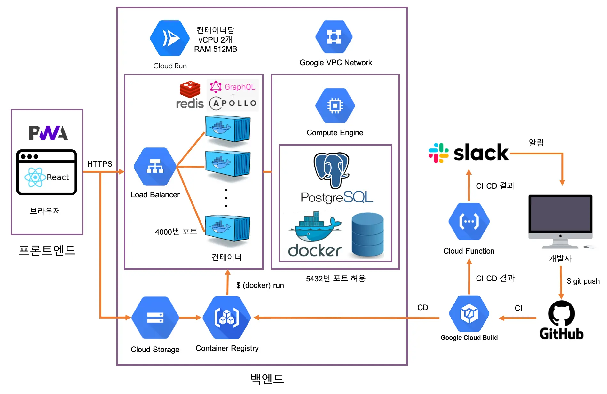

# 🦙 알파카 살롱 (Alpaca Salon) Backend

알파카가 모여 공감해주고 즐겁게 얘기하는 공간

## Requires

- macOS 11.5
- [Git](https://git-scm.com/downloads) 2.32
- [Node](https://hub.docker.com/_/node) 16 Alpine
- [Yarn](https://yarnpkg.com/getting-started/install#about-global-installs) berry
- [Visual Studio Code](https://code.visualstudio.com/Download) 1.61
- [PostgreSQL](https://hub.docker.com/_/postgres) 14 Alpine
- [Docker](https://www.docker.com/get-started) 20.10
- Docker Compose 1.29

```bash
$ git --version
$ node --version
$ yarn --version
$ code --version
$ docker --version
$ docker-compose --version
```

위 명령어를 통해 프로젝트에 필요한 모든 프로그램이 설치되어 있는지 확인합니다.

## Project structure



## Quick start

### Download codes

```bash
$ git clone https://github.com/rmfpdlxmtidl/alpaca-salon-backend.git
$ cd alpaca-salon-backend
$ git checkout main
$ yarn
```

프로젝트를 다운로드 받고 해당 폴더로 이동한 후 적절한 브랜치(`main` 등)로 이동하고 프로젝트에 필요한 외부 패키지를 설치합니다.

그리고 프로젝트 폴더에서 VSCode를 실행하면 오른쪽 아래에 '권장 확장 프로그램 설치' 알림이 뜨는데, 프로젝트에서 권장하는 확장 프로그램(ESLint, Prettier 등)을 모두 설치합니다.

### Create environment variables

```
PORT=4000

CONNECTION_STRING=postgresql://DB계정이름:DB계정암호@DB서버주소:포트/DB이름

JWT_SECRET_KEY=임의의문자열

GOOGLE_CLIENT_ID=
GOOGLE_CLIENT_SECRET=

KAKAO_REST_API_KEY=
KAKAO_ADMIN_KEY=

FRONTEND_URL=

# for `yarn generate-db`
POSTGRES_DB=DB이름
```

루트 폴더에 `.env`, `.env.development`, `.env.test` 파일을 생성하고 프로젝트에서 사용되는 환경 변수를 설정합니다.

### Initialize database

```bash
yarn import-db 환경변수파일위치
```

그리고 `import-db` 스크립트를 실행해 [`database/initialization.sql`](database/initialization.sql)와 CSV 파일로 되어 있는 더미데이터를 넣어줍니다.

### Start Node.js server

```shell
$ yarn dev
```

TypeScript 파일을 그대로 사용해 Nodemon으로 서비스를 실행합니다.

or

```shell
$ yarn build && yarn start
```

TypeScript 파일을 JavaScript로 트랜스파일한 후 Node.js로 서비스를 실행합니다.

or

```shell
$ docker-compose up --detach --build --force-recreate
```

(Cloud Run 환경과 동일한) Docker 환경에서 Node.js 서버를 실행합니다.

## Cloud

### GCP Cloud Run

Cloud Run이 GitHub 저장소 변경 사항을 자동으로 감지하기 때문에 GitHub로 commit을 push할 때마다 Cloud Run에 자동으로 배포됩니다.

### GCP Cloud SQL

#### Configure database

```sql
CREATE DATABASE alpaca_salon OWNER alpaca_salon TEMPLATE template0 LC_COLLATE "C" LC_CTYPE "ko_KR.UTF-8";
\c alpaca_salon postgres
ALTER SCHEMA public OWNER TO alpaca_salon;
```

#### Connect to Cloud SQL with proxy

```
gcloud auth login
gcloud config set project $PROJECT_NAME

curl -o cloud_sql_proxy https://dl.google.com/cloudsql/cloud_sql_proxy.darwin.amd64
chmod +x cloud_sql_proxy
./cloud_sql_proxy -instances=$CONNECTION_NAME=tcp:54321

psql "host=127.0.0.1 port=54321 sslmode=disable dbname=$POSTGRES_DB user=$POSTGRES_USER"
```

#### Database schema update

```bash
yarn export-db .env
initialization.sql
CSV 데이터 구조 수정
yarn import-db .env
```

### GCP Cloud Function

#### Slack

```bash
# https://github.com/rmfpdlxmtidl/google-cloud-build-slack
export SLACK_WEBHOOK_URL=
export PROJECT_ID=
./setup.sh
```

## Scripts

#### `test`

실행 중인 GraphQL 서버에 테스트용 GraphQL 쿼리를 요청하고 응답을 검사합니다. 이 스크립트를 실행 하기 전에 `localhost` 또는 원격에서 GraphQL API 서버를 실행해야 합니다.

#### `generate-db`

```bash
$ yarn generate-db {환경 변수 파일 위치}
```

PostgreSQL 데이터베이스 구조를 바탕으로 TypeScript 기반 자료형이 담긴 파일을 생성합니다.

#### `export-db`

```bash
$ yarn export-db {환경 변수 파일 위치}
```

PostgreSQL 데이터베이스에 있는 모든 스키마의 모든 테이블을 CSV 파일로 저장합니다. 더미 데이터 CSV 파일을 변경하기 전에 수행합니다.

#### `import-db`

```bash
$ yarn import-db {환경 변수 파일 위치}
```

CSV 파일을 PostgreSQL 데이터베이스에 삽입합니다.

## Slack

```
https://slack.github.com/

# https://github.com/integrations/slack#subscribing-and-unsubscribing
/github subscribe rmfpdlxmtidl/alpaca-salon-backend commits:* reviews comments
/github unsubscribe rmfpdlxmtidl/alpaca-salon-backend deployments
```
